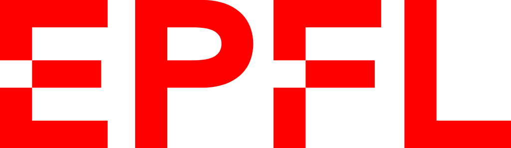

# CNNs for Multiple Sclerosis lesion detection

<table><tr>
<td>  </td>
<td>  </td>
</tr></table>

Project carried out within the framework of the European project [DeepHealth](https://deephealth-project.eu/) using the infrastructure of the [EPFL](https://www.epfl.ch/en/) _Embedded Systems Laboratory_. The final report can be accessed [here](./report/CNN_for_MS_Lesion_segmentation.pdf).

* **Author:** Francisco Javier Blázquez Martínez
* **Director:** Prof. David Atienza Alonso
* **Supervisors:** Dr. Arman Iranfar, Dr. Marina Zapater, Dr. Tomás Teijeiro Campo

## Abstract

Deep Learning techniques applied to medicine have proven to be more and more useful in recent years. The [DeepHealth](https://deephealth-project.eu/) emerges as a way to provide state-of-the-art deep learning high performance computing tools adapted to their usage in medicine. In this project we create 2D and 3D models for detecting Multiple Sclerosis lesions in Magnetic Resonance Images and we evaluate the performance of [EDDL](https://github.com/deephealthproject/eddl) library and compare it against [tensorflow](https://www.tensorflow.org/).

## Project structure

In this project we first created, evaluated and profiled 2D image segmentation models starting with the classical U-Net.
EDDL and tensorflow models can be accessed [here](./models/2d/u_net/). Their structure schema is the following: \

The other 2D model analyzed was a later improvement over the U-Net model, the Double U-Net. EDDL and tensorflow models can be accessed [here](./models/2d/double_unet/). Double U-Net architecture is the following: \

We finally analyzed a 3D cascade model proposed by Sergi Valverde with the following structure: \

